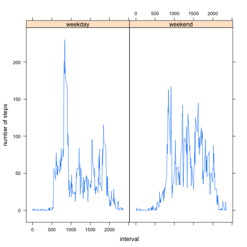

# Reproducible Research: Peer Assessment 1


## Loading and preprocessing the data
### unzip the file "activity.zip" and read the file into variable "activity"

```r
unzip("activity.zip", overwrite = TRUE)
activity <- read.csv("activity.csv")
```

## What is mean total number of steps taken per day?
### Transform the data to show caculate the total number of steps taken per day.

```r
require(plyr)
total_steps_perday <- ddply(activity, .(date), summarize, sum = sum(steps, na.rm=TRUE))
```
###1.Make a histogram of the total number of steps taken each day

```r
hist(total_steps_perday$sum)
```

 

###2.Calculate and report the mean and median total number of steps taken per day

```r
mean(total_steps_perday$sum)
```

```
## [1] 9354
```

```r
median(total_steps_perday$sum)
```

```
## [1] 10395
```

## What is the average daily activity pattern?
###1.Make a time series plot (i.e. type = "l") of the 5-minute interval (x-axis) and the average number of steps taken, averaged across all days (y-axis)
<1>Transform the data to show caculate the average number of steps taken , averaged across all days.

```r
average_steps_interval <- ddply(activity, .(interval), summarize, mean = mean(steps, na.rm=TRUE))
```
<2>make a time series plot

```r
plot(average_steps_interval,type="l", xlab="5-minute interval", ylab="Average number of steps")
```

 

###2.Which 5-minute interval, on average across all the days in the dataset, contains the maximum number of steps?

```r
average_steps_interval[average_steps_interval$mean == max(average_steps_interval$mean),]
```

```
##     interval  mean
## 104      835 206.2
```

## Imputing missing values
###1.Calculate and report the total number of missing values in the dataset (i.e. the total number of rows with NAs)

```r
nrow(activity[is.na(activity$steps),])
```

```
## [1] 2304
```

###2.Devise a strategy for filling in all of the missing values in the dataset. The strategy does not need to be sophisticated. For example, you could use the mean/median for that day, or the mean for that 5-minute interval, etc.
Use mean for that 5-minute interval to fit in all of the missing values in the dataset.
Create a function name fill_na, which simpply accept 2 variables: the value of the step, and interval, if the step is NA, return the average of steps for that 5-minute interval, else return the value of the step itself.


```r
fill_na <- function(step, interval){
  step_mean = average_steps_interval[(average_steps_interval$interval == interval),"mean"]
  if(is.na(step)){
    step_mean
  }else{
    step 
  }
}

fill_na_array <- function(steps, intervals){
  number = 0
  new_steps = steps
  for(step in steps){
    number = number +1
    new_steps[number] <- fill_na(steps[number], intervals[number])
  }
  new_steps
}
```

###3.Create a new dataset that is equal to the original dataset but with the missing data filled in.

```r
new_activity <- transform(activity, steps = fill_na_array(steps, interval))
```

###4.Make a histogram of the total number of steps taken each day and Calculate and report the mean and median total number of steps taken per day. Do these values differ from the estimates from the first part of the assignment? What is the impact of imputing missing data on the estimates of the total daily number of steps?
## What is mean total number of steps taken per day?
### Transform the data to show caculate the new total number of steps taken per day.

```r
new_total_steps_perday <- ddply(new_activity, .(date), summarize, sum = sum(steps, na.rm=TRUE))
```
###1.Make a histogram of the total number of steps taken each day

```r
hist(new_total_steps_perday$sum)
```

 

###2.Calculate and report the mean and median total number of steps taken per day

```r
mean(new_total_steps_perday$sum)
```

```
## [1] 10766
```

```r
median(new_total_steps_perday$sum)
```

```
## [1] 10766
```
Compare with the first part, we can find that replace the missing data with the average number of steps in the interval would elevate the total total daily number of steps, and significantly increase the frequence of the middle value of total steps of every day.

## Are there differences in activity patterns between weekdays and weekends?
###1.Create a new factor variable in the dataset with two levels -- "weekday" and "weekend" indicating whether a given date is a weekday or weekend day.
create a function return_day to identify if a date is weekday or weekend.

```r
  return_day <- function(date){
    day ="weekday"
    if(weekdays(date) == "星期六"||weekdays(date) =="星期日"){
      day = "weekend"
    }
    day
  }
  return_days <- function(dates){
    days = ""
    
    for(number in 1:length(dates)){
        days[number] = return_day(dates[number])
    }
    days
    }
```

Use return_days function to add a new variable to new_activity


```r
new_activity$date <- as.Date(new_activity$date)
new_activity$day <- as.factor(return_days(new_activity$date))
```

###2.Make a panel plot containing a time series plot (i.e. type = "l") of the 5-minute interval (x-axis) and the average number of steps taken, averaged across all weekday days or weekend days (y-axis). The plot should look something like the following, which was creating using simulated data

<1>Transform the data to show caculate the average number of steps taken , averaged across all days.

```r
new_average_steps_interval <- ddply(new_activity, .(interval,day), summarize, mean = mean(steps, na.rm=TRUE))
```

<2>make a time series plot

```r
require(lattice)

xyplot(mean~interval|day , data=new_average_steps_interval, type="l",ylab="number of steps")
```

 
